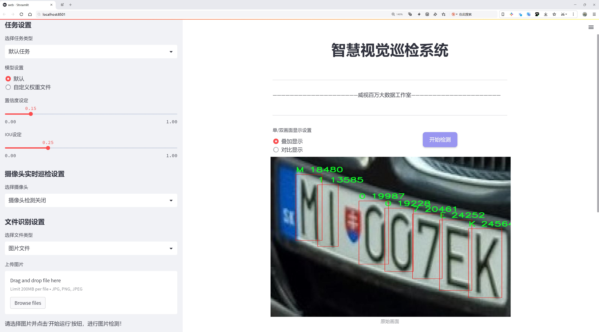
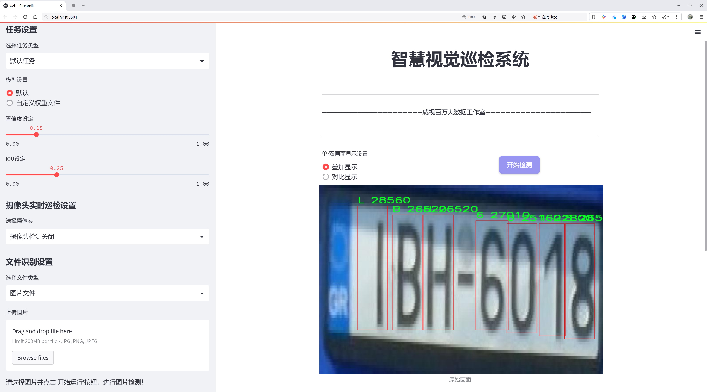
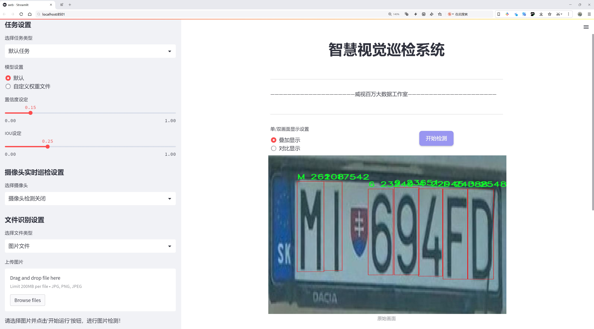
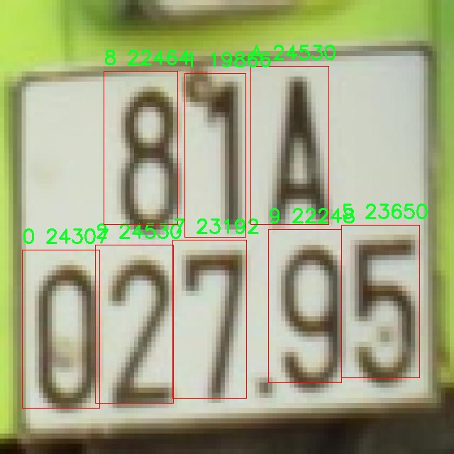
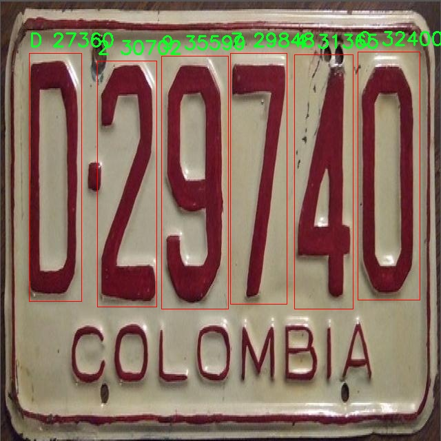
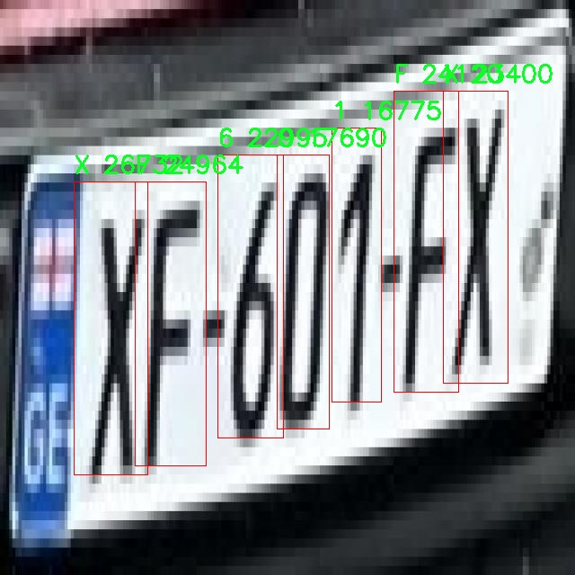
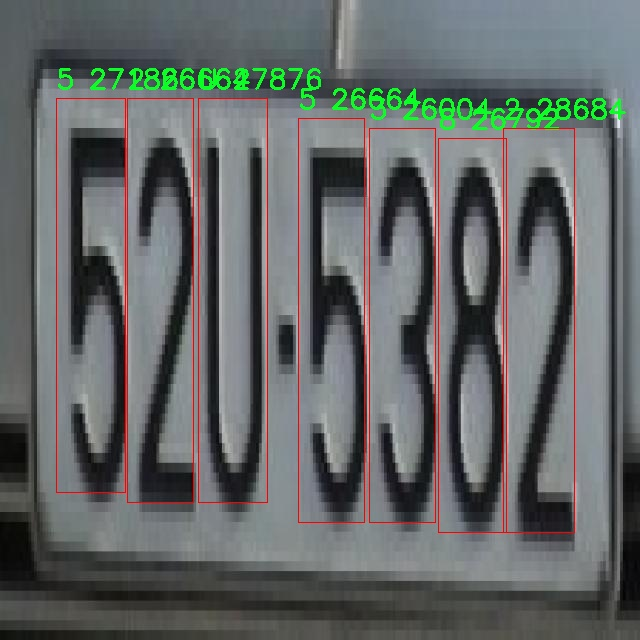
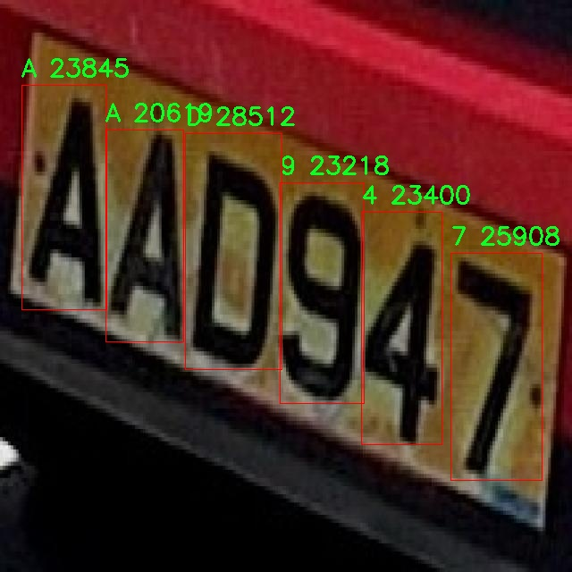

# 车牌字符识别系统源码分享
 # [一条龙教学YOLOV8标注好的数据集一键训练_70+全套改进创新点发刊_Web前端展示]

### 1.研究背景与意义

项目参考[AAAI Association for the Advancement of Artificial Intelligence](https://gitee.com/qunmasj/projects)

项目来源[AACV Association for the Advancement of Computer Vision](https://kdocs.cn/l/cszuIiCKVNis)

研究背景与意义

随着城市化进程的加快，机动车辆的数量不断增加，交通管理面临着前所未有的挑战。车牌识别技术作为智能交通系统的重要组成部分，已广泛应用于交通监控、停车管理、电子收费等领域。传统的车牌识别方法多依赖于图像处理和模式识别技术，然而这些方法在复杂环境下的识别准确率往往不尽如人意。因此，基于深度学习的车牌字符识别系统逐渐成为研究的热点，其中YOLO（You Only Look Once）系列模型因其高效的实时检测能力而备受关注。

YOLOv8作为YOLO系列的最新版本，在目标检测领域展现出了优异的性能。其通过改进的网络结构和训练策略，能够在保持高精度的同时，实现更快的推理速度。这一特性使得YOLOv8在车牌字符识别任务中具有广泛的应用潜力。然而，尽管YOLOv8在目标检测方面表现出色，但在特定的字符识别任务中，仍然存在一定的局限性，尤其是在字符密集、背景复杂的情况下。因此，针对YOLOv8进行改进，以提升其在车牌字符识别中的表现，具有重要的研究意义。

本研究将基于改进YOLOv8的车牌字符识别系统，利用一个包含2700张图像和36个类别的车牌数据集进行训练和测试。该数据集涵盖了从0到9的数字以及从A到Z的字母，能够有效模拟实际车牌的字符组合。通过对数据集的深入分析，我们可以发现，字符的多样性和复杂性为模型的训练提出了更高的要求。因此，改进YOLOv8的网络结构、损失函数以及数据增强策略，将有助于提高模型对不同字符的识别能力，进而提升整体的识别准确率。

此外，随着深度学习技术的不断发展，如何在保证模型性能的同时降低计算复杂度和资源消耗，成为了研究者们亟待解决的问题。通过对YOLOv8的改进，我们不仅可以探索更高效的网络架构，还可以在实际应用中实现更快速的推理，满足实时车牌识别的需求。这对于交通管理、智能停车等应用场景具有重要的现实意义。

综上所述，基于改进YOLOv8的车牌字符识别系统的研究，不仅有助于推动车牌识别技术的发展，也为智能交通系统的优化提供了新的思路和方法。通过本研究，我们期望能够在车牌字符识别领域取得突破性进展，为未来的智能交通管理提供更为精准和高效的技术支持。

### 2.图片演示







##### 注意：由于此博客编辑较早，上面“2.图片演示”和“3.视频演示”展示的系统图片或者视频可能为老版本，新版本在老版本的基础上升级如下：（实际效果以升级的新版本为准）

  （1）适配了YOLOV8的“目标检测”模型和“实例分割”模型，通过加载相应的权重（.pt）文件即可自适应加载模型。

  （2）支持“图片识别”、“视频识别”、“摄像头实时识别”三种识别模式。

  （3）支持“图片识别”、“视频识别”、“摄像头实时识别”三种识别结果保存导出，解决手动导出（容易卡顿出现爆内存）存在的问题，识别完自动保存结果并导出到tempDir中。

  （4）支持Web前端系统中的标题、背景图等自定义修改，后面提供修改教程。

  另外本项目提供训练的数据集和训练教程,暂不提供权重文件（best.pt）,需要您按照教程进行训练后实现图片演示和Web前端界面演示的效果。

### 3.视频演示

[3.1 视频演示](https://www.bilibili.com/video/BV1pF1yYDE2J/)

### 4.数据集信息展示

##### 4.1 本项目数据集详细数据（类别数＆类别名）

nc: 36
names: ['0', '1', '2', '3', '4', '5', '6', '7', '8', '9', 'A', 'B', 'C', 'D', 'E', 'F', 'G', 'H', 'I', 'J', 'K', 'L', 'M', 'N', 'O', 'P', 'Q', 'R', 'S', 'T', 'U', 'V', 'W', 'X', 'Y', 'Z']


##### 4.2 本项目数据集信息介绍

数据集信息展示

在本研究中，我们使用了名为“binhlt”的数据集，以改进YOLOv8的车牌字符识别系统。该数据集专门设计用于字符识别任务，包含36个类别，涵盖了数字和字母的组合，具体类别包括从数字0到9，以及字母A到Z。这种丰富的类别设置使得数据集能够有效地模拟真实世界中车牌的多样性，提供了良好的训练基础。

“binhlt”数据集的构建考虑到了车牌字符的多样性和复杂性，旨在提高YOLOv8在车牌识别任务中的准确性和鲁棒性。数据集中包含的字符类别包括十个阿拉伯数字（0-9）和二十六个英文字母（A-Z），这使得模型在识别过程中能够处理广泛的字符组合。车牌通常由这些字符组成，因此数据集的设计充分考虑了实际应用场景，确保了训练模型时所需的多样性和代表性。

在数据集的构建过程中，研究团队对字符的采集和标注进行了严格的控制，确保每个字符在不同背景、光照和角度下的表现都能被充分记录。这种多样化的采集方式不仅增强了数据集的全面性，也为模型的训练提供了丰富的样本，帮助模型学习到更为复杂的特征。这对于提升YOLOv8在车牌字符识别中的表现至关重要，因为车牌的外观可能因环境因素而变化，模型需要具备良好的适应能力。

此外，数据集中的每个字符样本都经过精心标注，确保了训练过程中的准确性。标注不仅包括字符本身的类别信息，还考虑到了字符在车牌中的位置和排列顺序。这种细致的标注方式为YOLOv8提供了必要的上下文信息，使得模型能够更好地理解字符之间的关系，从而提高识别的准确率。

在训练过程中，研究团队还采用了数据增强技术，以进一步提高模型的泛化能力。通过对“binhlt”数据集中的样本进行旋转、缩放、裁剪和颜色变换等处理，模型能够接触到更多样化的输入，从而在实际应用中表现得更加稳健。这种增强策略有效地扩展了数据集的有效样本数量，使得模型在面对不同车牌样式时，能够保持较高的识别精度。

综上所述，“binhlt”数据集为改进YOLOv8的车牌字符识别系统提供了坚实的基础。其丰富的类别设置、严格的标注标准以及有效的数据增强策略，确保了模型在训练过程中能够充分学习到车牌字符的特征。随着研究的深入，我们期待该数据集能够为车牌识别技术的发展贡献更多的力量，推动智能交通系统的进步。通过不断优化和完善识别算法，我们希望能够实现更高效、更准确的车牌识别，最终为交通管理和安全提供有力支持。











### 5.全套项目环境部署视频教程（零基础手把手教学）

[5.1 环境部署教程链接（零基础手把手教学）](https://www.ixigua.com/7404473917358506534?logTag=c807d0cbc21c0ef59de5)


[5.2 安装Python虚拟环境创建和依赖库安装视频教程链接（零基础手把手教学）](https://www.ixigua.com/7404474678003106304?logTag=1f1041108cd1f708b01a)

### 6.手把手YOLOV8训练视频教程（零基础小白有手就能学会）

[6.1 手把手YOLOV8训练视频教程（零基础小白有手就能学会）](https://www.ixigua.com/7404477157818401292?logTag=d31a2dfd1983c9668658)


按照上面的训练视频教程链接加载项目提供的数据集，运行train.py即可开始训练



     Epoch   gpu_mem       box       obj       cls    labels  img_size
     1/200     20.8G   0.01576   0.01955  0.007536        22      1280: 100%|██████████| 849/849 [14:42<00:00,  1.04s/it]
               Class     Images     Labels          P          R     mAP@.5 mAP@.5:.95: 100%|██████████| 213/213 [01:14<00:00,  2.87it/s]
                 all       3395      17314      0.994      0.957      0.0957      0.0843

     Epoch   gpu_mem       box       obj       cls    labels  img_size
     2/200     20.8G   0.01578   0.01923  0.007006        22      1280: 100%|██████████| 849/849 [14:44<00:00,  1.04s/it]
               Class     Images     Labels          P          R     mAP@.5 mAP@.5:.95: 100%|██████████| 213/213 [01:12<00:00,  2.95it/s]
                 all       3395      17314      0.996      0.956      0.0957      0.0845

     Epoch   gpu_mem       box       obj       cls    labels  img_size
     3/200     20.8G   0.01561    0.0191  0.006895        27      1280: 100%|██████████| 849/849 [10:56<00:00,  1.29it/s]
               Class     Images     Labels          P          R     mAP@.5 mAP@.5:.95: 100%|███████   | 187/213 [00:52<00:00,  4.04it/s]
                 all       3395      17314      0.996      0.957      0.0957      0.0845


### 7.70+种全套YOLOV8创新点代码加载调参视频教程（一键加载写好的改进模型的配置文件）

[7.1 70+种全套YOLOV8创新点代码加载调参视频教程（一键加载写好的改进模型的配置文件）](https://www.ixigua.com/7404478314661806627?logTag=29066f8288e3f4eea3a4)

### 8.70+种全套YOLOV8创新点原理讲解（非科班也可以轻松写刊发刊，V10版本正在科研待更新）

#### 由于篇幅限制，每个创新点的具体原理讲解就不一一展开，具体见下列网址中的创新点对应子项目的技术原理博客网址【Blog】：


[8.1 70+种全套YOLOV8创新点原理讲解链接](https://gitee.com/qunmasj/good)

#### 部分改进原理讲解(完整的改进原理见上图和技术博客链接)
### YOLOv8简介
YOLOv8目标检测算法继承了YOLOv1系列的思考,是一种新型端到端的目标检测算法,尽管现在原始检测算法已经开源,但是鲜有发表的相关论文.YOLOv8的网络结构如图所示,主要可分为Input输入端、Backbone骨干神经网络、Neck 混合特征网络层和Head预测层网络共4个部分.

YOLO目标检测算法是一种端到端的One-Slage 目标检测算法，其核心思想是将图像按区域分块进行预测。YOLO将输入图像按照32x32的大小划分成若干个网格，例如416x416的图像将被划分为13x13个网格。当目标物体的中心位于某个网格内时,该网格就会负责输出该物体的边界框和类别置信度。每个网格可以预测多个边界框和多个目标类别,这些边界框和类别的数量可以根据需要进行设置。YOLO算法的输出是一个特征图,包含了每个网格对应的边界框和类别置信度的信息呵。本文采用YOLO最新的YOLOv8模型，其是2022年底发布的最新YOLO系列模型，采用全新的SOTA模型，全新的网络主干结构,如图1所示。
整个网络分为Backbone 骨干网络部分和Head头部网络部分。YOLOv8汲取了前几代网络的优秀特性，骨干网络和 Neck部分遵循CSP的思想，将YOLOv5中的C3模块被替换成了梯度流更丰富C2模块,去掉YOLOv5中 PAN-FPN上采样阶段中的卷积结构,将Backbone不同阶段输出的特征直接送入了上采样操作,模型提供了N/S/M/L/X尺度的不同大小模型,能够满足不同领域业界的需求。本文基于YOLOv8模型设计番茄病虫害检测系统，通过配置模型参数训练番茄图像,得到能够用于部署应用的最优模型。


### 感受野注意力卷积（RFAConv)
#### 标准卷积操作回顾
标准的卷积操作是构造卷积神经网络的基本构件。它利用具有共享参数的滑动窗口提取特征信息，克服了全连通层构造神经网络固有的参数多、计算开销大的问题。设 X R∈C×H×W
表示输入特征图，其中C、H、W分别表示特征图的通道数、高度、宽度。为了清楚地演示卷积核的特征提取过程，我们使用 C = 1 的例子。从每个接受域滑块中提取特征信息的卷积运算可以表示为:


这里，Fi 表示计算后每个卷积滑块得到的值，Xi 表示每个滑块内对应位置的像素值，K表示卷积核，S表示卷积核中的参数个数，N表示接收域滑块的总数。可以看出，每个滑块内相同位置的 feature共享相同的参数Ki。因此，标准的卷积运算并不能捕捉到不同位置所带来的信息差异，这最终在一定程度上限制了卷积神经网络的性能。 

#### 空间注意力回顾
目前，空间注意机制是利用学习得到的注意图来突出每个特征的重要性。与前一节类似，这里以 C=1为例。突出关键特征的空间注意机制可以简单表述为:这里，Fi 表示加权运算后得到的值。xi 和Ai 表示输入特征图和学习到的注意图在不同位置的值，N为输入特征图的高和宽的乘积，表示像素值的总数。


#### 空间注意与标准卷积运算
将注意力机制整合到卷积神经网络中，可以提高卷积神经网络的性能。通过对标准卷积运算和现有空间注意机制的研究，我们认为空间注意机制有效地克服了卷积神经网络固有的参数共享的局限性。目前卷积神经网络中最常用的核大小是 1 × 1和3 × 3。在引入空间注意机制后，提取特征的卷积操作可以是 1 × 1或3 × 3卷积操作。为了直观地展示这个过程，在 1 × 1卷积运算的前面插入了空间注意机制。通过注意图对输入特征图(Re-weight“×”)进行加权运算，最后通过 1 × 1卷积运算提取接收域的滑块特征信息。整个过程可以简单地表示如下:


 这里卷积核K仅代表一个参数值。如果取A i× ki 的值作为一种新的卷积核参数，有趣的是它解决了 1×1卷积运算提取特征时的参数共享问题。然而，关于空间注意机制的传说到此结束。当空间注意机制被插入到3×3卷积运算前面时。具体情况如下:


如上所述，如果取A的值 i × ki (4)式作为一种新的卷积核参数，完全解决了大规模卷积核的参数共享问题。然而，最重要的一点是，卷积核在提取每个接受域滑块的特征时，会共享一些特征。换句话说，每个接收域滑块内都有一个重叠。仔细分析后会发现A12= a21， a13 = a22， a15 = a24……，在这种情况下，每个滑动窗口共享空间注意力地图的权重。因此，空间注意机制没有考虑整个接受域的空间特征，不能有效地解决大规模卷积核的参数共享问题。因此，空间注意机制的有效性受到限制。 

#### 创新空间注意力和标准卷积操作
该博客提出解决了现有空间注意机制的局限性，为空间处理提供了一种创新的解决方案。受RFA的启发，一系列空间注意机制被开发出来，可以进一步提高卷积神经网络的性能。RFA可以看作是一个轻量级即插即用模块，RFA设计的卷积运算(RFAConv)可以代替标准卷积来提高卷积神经网络的性能。因此，我们预测空间注意机制与标准卷积运算的结合将继续发展，并在未来带来新的突破。
接受域空间特征:为了更好地理解接受域空间特征的概念，我们将提供相关的定义。接收域空间特征是专门为卷积核设计的，并根据核大小动态生成。如图1所示，以3×3卷积核为例。在图1中，“Spatial Feature”指的是原始的Feature map。“接受域空间特征”是空间特征变换后的特征图。

 

由不重叠的滑动窗口组成。当使用 3×3卷积内核提取特征时，接收域空间特征中的每个 3×3大小窗口代表一个接收域滑块。接受域注意卷积(RFAConv):针对接受域的空间特征，我们提出了接受域注意卷积(RFA)。该方法不仅强调了接收域滑块内不同特征的重要性，而且对接收域空间特征进行了优先排序。通过该方法，完全解决了卷积核参数共享的问题。接受域空间特征是根据卷积核的大小动态生成的，因此，RFA是卷积的固定组合，不能与卷积操作的帮助分离，卷积操作同时依赖于RFA来提高性能，因此我们提出了接受场注意卷积(RFAConv)。具有3×3大小的卷积核的RFAConv整体结构如图所示。


目前，最广泛使用的接受域特征提取方法是缓慢的。经过大量的研究，我们开发了一种快速的方法，用分组卷积来代替原来的方法。具体来说，我们利用相应大小的分组卷积来动态生成基于接受域大小的展开特征。尽管与原始的无参数方法(如PyTorch提供的nn.())相比，该方法增加了一些参数，但它的速度要快得多。注意:如前一节所述，当使用 3×3卷积内核提取特征时，接收域空间特征中的每个 3×3大小窗口表示一个接收域滑块。而利用快速分组卷积提取感受野特征后，将原始特征映射为新的特征。最近的研究表明。交互信息可以提高网络性能，如[40,41,42]所示。同样，对于RFAConv来说，通过交互接受域特征信息来学习注意图可以提高网络性能。然而，与每个接收域特征交互会导致额外的计算开销，因此为了最小化计算开销和参数的数量，我们使用AvgPool来聚合每个接收域特征的全局信息。然后，使用 1×1 组卷积操作进行信息交互。最后，我们使用softmax来强调每个特征在接受域特征中的重要性。一般情况下，RFA的计算可以表示为:


这里gi×i 表示一个大小为 i×i的分组卷积，k表示卷积核的大小，Norm表示归一化，X表示输入的特征图，F由注意图 a相乘得到 rf 与转换后的接受域空间特征 Frf。与CBAM和CA不同，RFA能够为每个接受域特征生成注意图。卷积神经网络的性能受到标准卷积操作的限制，因为卷积操作依赖于共享参数，对位置变化带来的信息差异不敏感。然而，RFAConv通过强调接收域滑块中不同特征的重要性，并对接收域空间特征进行优先级排序，可以完全解决这个问题。通过RFA得到的feature map是接受域空间特征，在“Adjust Shape”后没有重叠。因此，学习到的注意图将每个接受域滑块的特征信息聚合起来。换句话说，注意力地图不再共享在每个接受域滑块。这完全弥补了现有 CA和CBAM注意机制的不足。RFA为标准卷积内核提供了显著的好处。而在调整形状后，特征的高度和宽度是 k倍，需要进行 stride = k的k × k卷积运算来提取特征信息。RFA设计的卷积运算RFAConv为卷积带来了良好的增益，对标准卷积进行了创新。
此外，我们认为现有的空间注意机制应该优先考虑接受域空间特征，以提高网络性能。众所周知，基于自注意机制的网络模型[43,44,45]取得了很大的成功，因为它解决了卷积参数共享的问题，并对远程信息进行建模。然而，自注意机制也为模型引入了显著的计算开销和复杂性。我们认为，将现有的空间注意机制的注意力引导到接受场空间特征上，可以以类似于自我注意的方式解决长期信息的参数共享和建模问题。与自我关注相比，这种方法需要的参数和计算资源少得多。答案如下:(1)将以接收场空间特征为中心的空间注意机制与卷积相结合，消除了卷积参数共享的问题。(2)现有的空间注意机制已经考虑了远程信息，可以通过全局平均池或全局最大池的方式获取全局信息，其中明确考虑了远程信息。因此，我们设计了新的 CBAM和CA模型，称为RFCBAM和RFCA，它们专注于接受域空间特征。与RFA类似，使用最终的k × k stride = k 的卷积运算来提取特征信息。这两种新的卷积方法的具体结构如图 3所示，我们称这两种新的卷积操作为 RFCBAMConv和RFCAConv。与原来的CBAM相比，我们在RFCBAM中使用SE attention来代替CAM。因为这样可以减少计算开销。此外，在RFCBAM中，通道注意和空间注意不是分开执行的。相反，它们是同时加权的，使得每个通道获得的注意力地图是不同的。


### 9.系统功能展示（检测对象为举例，实际内容以本项目数据集为准）

图9.1.系统支持检测结果表格显示

  图9.2.系统支持置信度和IOU阈值手动调节

  图9.3.系统支持自定义加载权重文件best.pt(需要你通过步骤5中训练获得)

  图9.4.系统支持摄像头实时识别

  图9.5.系统支持图片识别

  图9.6.系统支持视频识别

  图9.7.系统支持识别结果文件自动保存

  图9.8.系统支持Excel导出检测结果数据


### 10.原始YOLOV8算法原理

原始YOLOv8算法原理

YOLOv8算法是由Ultralytics公司于2023年推出的最新版本，标志着YOLO系列目标检测算法的又一次重要进化。该算法在YOLOv5和YOLOv7的基础上进行了多项创新和改进，旨在提高目标检测的速度和精度，同时保持模型的轻量化。YOLOv8的架构包括多个版本，如YOLOv8n、YOLOv8s和YOLOv8m，其中YOLOv8n作为轻量级版本，特别适合资源受限的环境。

在YOLOv8中，主干网络采用了CSP（Cross Stage Partial）结构，进一步优化了特征提取过程。CSP结构将特征提取分为两个部分，通过卷积和连接的方式，使得网络在保持高效性的同时，能够更好地捕捉到输入图像中的重要特征。与YOLOv5的C3模块相比，YOLOv8引入了C2f模块，这一模块的设计灵感来源于YOLOv7的ELAN（Efficient Layer Aggregation Network）思想。C2f模块通过增加多个shortcut连接，显著缓解了深层网络中的梯度消失问题，同时增强了浅层特征的重用能力。这种设计使得YOLOv8在特征提取的过程中，能够有效地提取到更丰富的特征信息，从而提高检测精度。

在特征融合层，YOLOv8采用了PAN-FPN（Path Aggregation Network - Feature Pyramid Network）结构。该结构的核心在于能够有效地融合来自不同层次的特征，确保网络在处理多尺度目标时，能够充分利用每一层的特征信息。YOLOv8的PAN-FPN结构通过自下而上的特征融合，结合了高层语义信息和低层细节信息，使得模型在进行目标检测时，能够更准确地定位和分类目标。与YOLOv5相比，YOLOv8在上采样阶段去掉了1x1卷积，简化了网络结构，提高了计算效率。

YOLOv8的检测网络采用了Anchor-Free的方式，这一创新使得模型在处理目标时不再依赖于预定义的锚框，从而减少了锚框选择的复杂性和计算成本。相应地，YOLOv8在Detect模块中引入了解耦头结构，分别处理目标的分类和边框回归任务。这样的设计使得网络在训练和推理过程中，能够更灵活地适应不同的目标检测场景，提高了模型的适用性和鲁棒性。

在损失函数方面，YOLOv8采用了VFLLoss作为分类损失，DFLLoss和CIoULoss作为回归损失。这些损失函数的设计旨在解决样本不平衡和难以分类的样本问题，尤其是在处理小目标时，能够有效提高模型的学习效果。此外，YOLOv8还引入了Task-Aligned的样本匹配策略，进一步优化了训练过程中的样本匹配效率。

在数据预处理方面，YOLOv8延续了YOLOv5的策略，采用了多种数据增强技术，如马赛克增强、混合增强、空间扰动和颜色扰动等。这些增强手段能够有效提高模型的泛化能力，使得YOLOv8在面对不同场景和条件下的目标检测任务时，表现出色。

整体而言，YOLOv8算法的设计理念是通过轻量化的网络结构和高效的特征提取与融合机制，来实现更快的推理速度和更高的检测精度。其创新的C2f模块、PAN-FPN结构以及Anchor-Free的检测方式，使得YOLOv8在目标检测领域中占据了领先地位。通过不断的技术迭代和优化，YOLOv8不仅提升了目标检测的性能，还为实际应用提供了更为灵活和高效的解决方案。无论是在智能监控、自动驾驶还是工业检测等领域，YOLOv8都展现出了广泛的应用潜力和价值。


### 11.项目核心源码讲解（再也不用担心看不懂代码逻辑）

#### 11.1 code\ultralytics\utils\callbacks\dvc.py

以下是对给定代码的核心部分进行提炼和详细注释的结果：

```python
# 导入必要的库和模块
from ultralytics.utils import LOGGER, SETTINGS, TESTS_RUNNING, checks

try:
    # 确保当前不是在测试模式下运行
    assert not TESTS_RUNNING  
    # 确保DVC集成已启用
    assert SETTINGS["dvc"] is True  
    import dvclive  # 导入DVC Live库

    # 检查dvclive的版本
    assert checks.check_version("dvclive", "2.11.0", verbose=True)

    import os
    import re
    from pathlib import Path

    # 初始化DVCLive logger实例
    live = None
    _processed_plots = {}  # 用于记录已处理的图表

    # 标志变量，表示当前是否在训练周期
    _training_epoch = False

except (ImportError, AssertionError, TypeError):
    dvclive = None  # 如果导入失败，则将dvclive设置为None


def _log_images(path, prefix=""):
    """记录指定路径的图像，使用DVCLive进行日志记录。"""
    if live:  # 如果live实例存在
        name = path.name

        # 通过批次分组图像，以便在UI中启用滑块
        m = re.search(r"_batch(\d+)", name)
        if m:
            ni = m[1]
            new_stem = re.sub(r"_batch(\d+)", "_batch", path.stem)
            name = (Path(new_stem) / ni).with_suffix(path.suffix)

        # 记录图像
        live.log_image(os.path.join(prefix, name), path)


def _log_plots(plots, prefix=""):
    """记录训练进度的图像，如果它们尚未被处理。"""
    for name, params in plots.items():
        timestamp = params["timestamp"]
        if _processed_plots.get(name) != timestamp:  # 检查图表是否已处理
            _log_images(name, prefix)  # 记录图像
            _processed_plots[name] = timestamp  # 更新已处理图表的时间戳


def _log_confusion_matrix(validator):
    """使用DVCLive记录给定验证器的混淆矩阵。"""
    targets = []
    preds = []
    matrix = validator.confusion_matrix.matrix  # 获取混淆矩阵
    names = list(validator.names.values())
    if validator.confusion_matrix.task == "detect":
        names += ["background"]  # 如果任务是检测，添加背景类

    # 填充目标和预测列表
    for ti, pred in enumerate(matrix.T.astype(int)):
        for pi, num in enumerate(pred):
            targets.extend([names[ti]] * num)
            preds.extend([names[pi]] * num)

    # 记录混淆矩阵
    live.log_sklearn_plot("confusion_matrix", targets, preds, name="cf.json", normalized=True)


def on_pretrain_routine_start(trainer):
    """在预训练例程开始时初始化DVCLive logger。"""
    try:
        global live
        live = dvclive.Live(save_dvc_exp=True, cache_images=True)  # 创建DVCLive实例
        LOGGER.info("DVCLive is detected and auto logging is enabled.")
    except Exception as e:
        LOGGER.warning(f"WARNING ⚠️ DVCLive installed but not initialized correctly: {e}")


def on_train_start(trainer):
    """如果DVCLive日志记录处于活动状态，则记录训练参数。"""
    if live:
        live.log_params(trainer.args)  # 记录训练参数


def on_fit_epoch_end(trainer):
    """在每个训练周期结束时记录训练指标和模型信息。"""
    global _training_epoch
    if live and _training_epoch:
        all_metrics = {**trainer.label_loss_items(trainer.tloss, prefix="train"), **trainer.metrics, **trainer.lr}
        for metric, value in all_metrics.items():
            live.log_metric(metric, value)  # 记录每个指标

        _log_plots(trainer.plots, "train")  # 记录训练图表
        live.next_step()  # 进入下一个步骤
        _training_epoch = False  # 重置训练周期标志


def on_train_end(trainer):
    """在训练结束时记录最佳指标、图表和混淆矩阵。"""
    if live:
        all_metrics = {**trainer.label_loss_items(trainer.tloss, prefix="train"), **trainer.metrics, **trainer.lr}
        for metric, value in all_metrics.items():
            live.log_metric(metric, value, plot=False)  # 记录最佳指标

        _log_confusion_matrix(trainer.validator)  # 记录混淆矩阵
        live.end()  # 结束日志记录


# 定义回调函数
callbacks = (
    {
        "on_pretrain_routine_start": on_pretrain_routine_start,
        "on_train_start": on_train_start,
        "on_fit_epoch_end": on_fit_epoch_end,
        "on_train_end": on_train_end,
    }
    if dvclive
    else {}
)
```

### 代码分析
1. **模块导入和初始化**：
   - 导入必要的模块并进行初始化，确保DVC集成已启用。
   - 检查`dvclive`库的版本，确保其符合要求。

2. **日志记录功能**：
   - 定义了多个日志记录函数，主要用于记录图像、图表和混淆矩阵等信息，以便于后续分析和可视化。

3. **训练过程中的回调**：
   - 通过定义回调函数，在训练的不同阶段（如开始、结束、每个周期结束）记录相关的训练参数和指标。

4. **全局变量**：
   - 使用全局变量来管理训练状态和日志记录的实例。

以上代码实现了一个完整的训练过程中的日志记录机制，利用`dvclive`库记录模型训练的各项指标和可视化信息，便于后续的分析和调试。

这个文件是一个用于集成DVCLive的回调函数模块，主要用于在Ultralytics YOLO项目中记录训练过程中的各种信息和指标。首先，文件通过导入必要的模块和库来进行初始化，包括日志记录器、设置和检查工具。接着，它尝试确保在测试运行时不记录日志，并验证DVCLive集成是否启用。

在文件中，定义了多个私有函数和回调函数，用于处理训练过程中的不同阶段。`_log_images`函数用于记录指定路径下的图像，并支持通过前缀进行分组，以便在用户界面中实现滑块功能。`_log_plots`函数则用于记录训练过程中的图像数据，确保每个图像只被处理一次。

`_log_confusion_matrix`函数用于记录混淆矩阵，它从验证器中提取目标和预测值，并使用DVCLive记录这些信息。接下来的几个回调函数分别在训练的不同阶段被调用，比如在预训练开始时初始化DVCLive记录器，训练开始时记录参数，训练每个epoch开始时设置标志，以及在每个fit epoch结束时记录训练指标和模型信息。

在训练结束时，`on_train_end`函数会记录最佳指标、图像和混淆矩阵，并在模型文件存在时将其记录为一个工件。最后，文件将所有的回调函数整理成一个字典，只有在DVCLive可用时才会被使用。

整体来看，这个模块通过回调机制与DVCLive集成，旨在提供实时的训练监控和可视化功能，帮助用户更好地理解和分析模型训练过程中的表现。

#### 11.2 70+种YOLOv8算法改进源码大全和调试加载训练教程（非必要）\ultralytics\engine\validator.py

以下是代码中最核心的部分，并附上详细的中文注释：

```python
class BaseValidator:
    """
    BaseValidator类用于创建验证器的基类。

    属性:
        args (SimpleNamespace): 验证器的配置。
        dataloader (DataLoader): 用于验证的数据加载器。
        model (nn.Module): 要验证的模型。
        device (torch.device): 用于验证的设备。
        speed (dict): 包含预处理、推理、损失和后处理的速度信息。
        save_dir (Path): 保存结果的目录。
    """

    def __init__(self, dataloader=None, save_dir=None, args=None):
        """
        初始化BaseValidator实例。

        参数:
            dataloader (torch.utils.data.DataLoader): 用于验证的数据加载器。
            save_dir (Path, optional): 保存结果的目录。
            args (SimpleNamespace): 验证器的配置。
        """
        self.args = get_cfg(overrides=args)  # 获取配置
        self.dataloader = dataloader  # 数据加载器
        self.model = None  # 模型初始化为None
        self.device = None  # 设备初始化为None
        self.speed = {'preprocess': 0.0, 'inference': 0.0, 'loss': 0.0, 'postprocess': 0.0}  # 速度字典
        self.save_dir = save_dir or get_save_dir(self.args)  # 保存目录

    @smart_inference_mode()
    def __call__(self, trainer=None, model=None):
        """支持验证预训练模型或正在训练的模型。"""
        self.device = select_device(self.args.device)  # 选择设备
        model = AutoBackend(model or self.args.model, device=self.device)  # 初始化模型
        model.eval()  # 设置模型为评估模式

        # 遍历数据加载器中的每个批次
        for batch_i, batch in enumerate(self.dataloader):
            # 预处理
            batch = self.preprocess(batch)

            # 推理
            preds = model(batch['img'])

            # 更新指标
            self.update_metrics(preds, batch)

        # 打印结果
        self.print_results()

    def preprocess(self, batch):
        """预处理输入批次。"""
        return batch  # 返回处理后的批次

    def update_metrics(self, preds, batch):
        """根据预测和批次更新指标。"""
        pass  # 具体实现留空

    def print_results(self):
        """打印模型预测的结果。"""
        pass  # 具体实现留空
```

### 代码说明：
1. **BaseValidator类**：这是一个基类，用于创建YOLO模型的验证器。它包含了验证过程中需要的各种属性和方法。

2. **`__init__`方法**：初始化验证器的配置、数据加载器、模型、设备和速度信息等。

3. **`__call__`方法**：这是一个可调用的方法，支持验证预训练模型或正在训练的模型。它选择设备，初始化模型，并遍历数据加载器进行验证。

4. **`preprocess`方法**：用于预处理输入的批次数据。可以根据需要扩展实现。

5. **`update_metrics`方法**：根据模型的预测结果和实际批次更新验证指标。具体实现留空，需根据需求实现。

6. **`print_results`方法**：用于打印模型的预测结果。具体实现留空，需根据需求实现。

这个简化的版本保留了核心功能，并且通过注释解释了每个部分的作用。

这个程序文件是Ultralytics YOLO模型的一个验证器类（BaseValidator），用于评估模型在测试集或验证集上的准确性。文件开头提供了使用说明，用户可以通过命令行调用该验证器来验证不同格式的YOLO模型，包括PyTorch、TorchScript、ONNX等多种格式。

在文件中，首先导入了一些必要的库和模块，包括json、time、Path、numpy和torch等。接着，定义了一个BaseValidator类，该类是创建验证器的基础类。类中包含多个属性，例如args（配置参数）、dataloader（数据加载器）、model（待验证的模型）、device（设备信息）等。

在构造函数__init__中，初始化了验证器的各项属性，并设置了保存结果的目录。如果未指定置信度（conf），则默认为0.001。还会检查图像尺寸是否符合要求。

__call__方法是该类的核心功能，支持对预训练模型或正在训练的模型进行验证。根据是否传入trainer参数，设置训练模式，并选择相应的设备和数据集。模型在验证前会进行预热，以提高推理速度。

在验证过程中，使用了一个进度条（TQDM）来显示验证进度，并初始化性能指标。对于每个批次，进行预处理、推理、损失计算和后处理，并更新性能指标。如果设置了绘图选项，还会在验证过程中绘制样本和预测结果。

该类还定义了一些辅助方法，例如匹配预测与真实标签、添加回调函数、运行回调、获取数据加载器等。还有一些方法用于初始化和更新性能指标、获取统计信息、打印结果等。

总的来说，这个BaseValidator类提供了一个结构化的框架，用于在YOLO模型的验证过程中进行各种操作，包括数据处理、模型推理和结果评估等。通过回调机制，用户可以在验证的不同阶段插入自定义操作，以满足特定需求。

#### 11.3 ui.py

以下是经过简化和注释的核心代码部分：

```python
import sys
import subprocess

def run_script(script_path):
    """
    使用当前 Python 环境运行指定的脚本。

    Args:
        script_path (str): 要运行的脚本路径

    Returns:
        None
    """
    # 获取当前 Python 解释器的路径
    python_path = sys.executable

    # 构建运行命令，使用 streamlit 运行指定的脚本
    command = f'"{python_path}" -m streamlit run "{script_path}"'

    # 执行命令并等待其完成
    result = subprocess.run(command, shell=True)
    
    # 检查命令执行结果，如果返回码不为0，则表示出错
    if result.returncode != 0:
        print("脚本运行出错。")

# 主程序入口
if __name__ == "__main__":
    # 指定要运行的脚本路径
    script_path = "web.py"  # 这里假设脚本在当前目录下

    # 调用函数运行脚本
    run_script(script_path)
```

### 代码注释说明：
1. **导入模块**：
   - `sys`：用于获取当前 Python 解释器的路径。
   - `subprocess`：用于执行外部命令。

2. **`run_script` 函数**：
   - 接收一个参数 `script_path`，表示要运行的 Python 脚本的路径。
   - 使用 `sys.executable` 获取当前 Python 解释器的路径。
   - 构建一个命令字符串，使用 `streamlit` 模块运行指定的脚本。
   - 使用 `subprocess.run` 执行命令，并等待其完成。
   - 检查命令的返回码，如果不为0，表示脚本运行出错，打印错误信息。

3. **主程序入口**：
   - 在 `__main__` 块中，指定要运行的脚本路径（假设为 `web.py`）。
   - 调用 `run_script` 函数来执行指定的脚本。

这个程序文件名为 `ui.py`，其主要功能是通过当前的 Python 环境运行一个指定的脚本，具体是一个名为 `web.py` 的文件。程序首先导入了必要的模块，包括 `sys`、`os` 和 `subprocess`，这些模块分别用于处理系统相关的操作、文件路径和执行外部命令。

在文件中定义了一个名为 `run_script` 的函数，该函数接受一个参数 `script_path`，表示要运行的脚本的路径。函数内部首先获取当前 Python 解释器的路径，这通过 `sys.executable` 实现。接着，构建一个命令字符串，该命令用于调用 `streamlit` 模块来运行指定的脚本。这里使用了 `subprocess.run` 方法来执行构建好的命令，并通过 `shell=True` 参数允许在 shell 中执行该命令。

在执行命令后，程序检查返回的结果码。如果返回码不为零，表示脚本运行过程中出现了错误，此时会打印出“脚本运行出错。”的提示信息。

在文件的最后部分，使用 `if __name__ == "__main__":` 语句来确保只有在直接运行该脚本时才会执行以下代码。这里指定了要运行的脚本路径为 `web.py`，并调用 `run_script` 函数来执行这个脚本。

总的来说，这个程序的作用是方便用户通过 `ui.py` 文件来启动并运行 `web.py` 脚本，利用当前 Python 环境的配置来执行 Streamlit 应用。

#### 11.4 train.py

以下是经过简化和注释的核心代码部分：

```python
import random
import numpy as np
import torch.nn as nn
from ultralytics.data import build_dataloader, build_yolo_dataset
from ultralytics.engine.trainer import BaseTrainer
from ultralytics.models import yolo
from ultralytics.nn.tasks import DetectionModel
from ultralytics.utils import LOGGER, RANK
from ultralytics.utils.torch_utils import de_parallel, torch_distributed_zero_first

class DetectionTrainer(BaseTrainer):
    """
    DetectionTrainer类，继承自BaseTrainer，用于基于检测模型的训练。
    """

    def build_dataset(self, img_path, mode="train", batch=None):
        """
        构建YOLO数据集。

        参数:
            img_path (str): 包含图像的文件夹路径。
            mode (str): 模式，`train`或`val`，可以为每种模式自定义不同的增强。
            batch (int, optional): 批次大小，仅用于`rect`模式。默认为None。
        """
        gs = max(int(de_parallel(self.model).stride.max() if self.model else 0), 32)  # 获取模型的最大步幅
        return build_yolo_dataset(self.args, img_path, batch, self.data, mode=mode, rect=mode == "val", stride=gs)

    def get_dataloader(self, dataset_path, batch_size=16, rank=0, mode="train"):
        """构造并返回数据加载器。"""
        assert mode in ["train", "val"]  # 确保模式有效
        with torch_distributed_zero_first(rank):  # 在分布式训练中，确保数据集只初始化一次
            dataset = self.build_dataset(dataset_path, mode, batch_size)  # 构建数据集
        shuffle = mode == "train"  # 训练模式下打乱数据
        workers = self.args.workers if mode == "train" else self.args.workers * 2  # 设置工作线程数
        return build_dataloader(dataset, batch_size, workers, shuffle, rank)  # 返回数据加载器

    def preprocess_batch(self, batch):
        """对图像批次进行预处理，包括缩放和转换为浮点数。"""
        batch["img"] = batch["img"].to(self.device, non_blocking=True).float() / 255  # 转换为浮点数并归一化
        if self.args.multi_scale:  # 如果启用多尺度
            imgs = batch["img"]
            sz = (
                random.randrange(self.args.imgsz * 0.5, self.args.imgsz * 1.5 + self.stride)
                // self.stride
                * self.stride
            )  # 随机选择新的尺寸
            sf = sz / max(imgs.shape[2:])  # 计算缩放因子
            if sf != 1:
                ns = [
                    math.ceil(x * sf / self.stride) * self.stride for x in imgs.shape[2:]
                ]  # 计算新的形状
                imgs = nn.functional.interpolate(imgs, size=ns, mode="bilinear", align_corners=False)  # 进行插值
            batch["img"] = imgs  # 更新批次图像
        return batch

    def get_model(self, cfg=None, weights=None, verbose=True):
        """返回YOLO检测模型。"""
        model = DetectionModel(cfg, nc=self.data["nc"], verbose=verbose and RANK == -1)  # 创建检测模型
        if weights:
            model.load(weights)  # 加载权重
        return model

    def plot_training_samples(self, batch, ni):
        """绘制带有注释的训练样本。"""
        plot_images(
            images=batch["img"],
            batch_idx=batch["batch_idx"],
            cls=batch["cls"].squeeze(-1),
            bboxes=batch["bboxes"],
            paths=batch["im_file"],
            fname=self.save_dir / f"train_batch{ni}.jpg",
            on_plot=self.on_plot,
        )

    def plot_metrics(self):
        """从CSV文件中绘制指标。"""
        plot_results(file=self.csv, on_plot=self.on_plot)  # 保存结果图
```

### 代码说明：
1. **DetectionTrainer类**：这是一个用于训练YOLO检测模型的类，继承自基础训练器`BaseTrainer`。
2. **build_dataset方法**：根据给定的图像路径和模式构建YOLO数据集。
3. **get_dataloader方法**：构造数据加载器，支持训练和验证模式。
4. **preprocess_batch方法**：对输入的图像批次进行预处理，包括归一化和多尺度调整。
5. **get_model方法**：创建并返回一个YOLO检测模型，可以选择加载预训练权重。
6. **plot_training_samples方法**：绘制训练样本及其对应的注释。
7. **plot_metrics方法**：从CSV文件中绘制训练过程中的指标图。

以上是代码的核心部分和详细注释，帮助理解YOLO模型的训练过程。

这个程序文件 `train.py` 是一个用于训练目标检测模型的代码，主要基于 YOLO（You Only Look Once）架构。它扩展了一个名为 `BaseTrainer` 的基类，提供了一系列用于构建数据集、数据加载器、模型训练和验证的功能。

首先，程序导入了一些必要的库和模块，包括数学运算、随机数生成、深度学习相关的库（如 PyTorch）以及 Ultralytics 提供的各种工具和模型。这些导入的模块和函数为后续的训练过程提供了基础。

在 `DetectionTrainer` 类中，定义了多个方法来处理训练过程中的不同任务。`build_dataset` 方法用于构建 YOLO 数据集，接收图像路径、模式（训练或验证）和批次大小作为参数。它使用 `build_yolo_dataset` 函数来创建数据集，并根据模型的步幅（stride）进行调整。

`get_dataloader` 方法则用于构建数据加载器，确保在分布式训练时只初始化一次数据集。它根据模式设置是否打乱数据，并根据训练或验证的不同配置数据加载器的工作线程数。

在 `preprocess_batch` 方法中，对输入的图像批次进行预处理，包括将图像缩放到适当的大小并转换为浮点数格式。这个方法还支持多尺度训练，通过随机选择图像的大小来增强模型的鲁棒性。

`set_model_attributes` 方法用于设置模型的属性，包括类别数量和类别名称等。这些信息是训练过程中必需的，确保模型能够正确处理输入数据。

`get_model` 方法返回一个 YOLO 检测模型，支持加载预训练权重。`get_validator` 方法则返回一个用于模型验证的 `DetectionValidator` 实例，负责在训练过程中评估模型的性能。

`label_loss_items` 方法用于返回一个包含训练损失项的字典，这在目标检测任务中是必要的。`progress_string` 方法生成一个格式化的字符串，用于显示训练进度，包括当前的轮次、GPU 内存使用情况和损失值等信息。

此外，`plot_training_samples` 方法用于绘制训练样本及其标注，便于可视化训练过程中的数据。`plot_metrics` 和 `plot_training_labels` 方法则用于绘制训练过程中的指标和标签，帮助用户理解模型的训练效果。

总体而言，这个文件提供了一个完整的框架，用于训练 YOLO 模型，包括数据处理、模型构建、训练和验证等多个方面的功能，适合用于目标检测任务的开发和研究。

#### 11.5 70+种YOLOv8算法改进源码大全和调试加载训练教程（非必要）\ultralytics\utils\ops.py

以下是代码中最核心的部分，并附上详细的中文注释：

```python
import torch
import torchvision

def non_max_suppression(
        prediction,
        conf_thres=0.25,
        iou_thres=0.45,
        classes=None,
        agnostic=False,
        multi_label=False,
        labels=(),
        max_det=300,
        nc=0,  # 类别数量（可选）
        max_time_img=0.05,
        max_nms=30000,
        max_wh=7680,
):
    """
    对一组边界框执行非最大抑制（NMS），支持掩码和每个框多个标签。

    参数:
        prediction (torch.Tensor): 形状为 (batch_size, num_classes + 4 + num_masks, num_boxes) 的张量，包含预测的框、类别和掩码。
        conf_thres (float): 置信度阈值，低于该值的框将被过滤。
        iou_thres (float): IoU阈值，低于该值的框在NMS期间将被过滤。
        classes (List[int]): 要考虑的类别索引列表。如果为None，则考虑所有类别。
        agnostic (bool): 如果为True，模型对类别数量不敏感，所有类别将被视为一个。
        multi_label (bool): 如果为True，每个框可能有多个标签。
        labels (List[List[Union[int, float, torch.Tensor]]]): 每个图像的先验标签列表。
        max_det (int): NMS后要保留的最大框数量。
        nc (int, optional): 模型输出的类别数量。
        max_time_img (float): 处理一张图像的最大时间（秒）。
        max_nms (int): 传递给torchvision.ops.nms()的最大框数量。
        max_wh (int): 最大框宽度和高度（像素）。

    返回:
        (List[torch.Tensor]): 长度为batch_size的列表，每个元素是形状为(num_boxes, 6 + num_masks)的张量，包含保留的框。
    """

    # 检查参数有效性
    assert 0 <= conf_thres <= 1, f'无效的置信度阈值 {conf_thres}，有效值在0.0到1.0之间'
    assert 0 <= iou_thres <= 1, f'无效的IoU {iou_thres}，有效值在0.0到1.0之间'
    
    # 如果预测结果是列表或元组，选择推理输出
    if isinstance(prediction, (list, tuple)):
        prediction = prediction[0]  # 选择推理输出

    device = prediction.device  # 获取设备信息
    bs = prediction.shape[0]  # 批量大小
    nc = nc or (prediction.shape[1] - 4)  # 类别数量
    nm = prediction.shape[1] - nc - 4  # 掩码数量
    mi = 4 + nc  # 掩码起始索引
    xc = prediction[:, 4:mi].amax(1) > conf_thres  # 置信度候选框

    # 处理每张图像的预测结果
    output = [torch.zeros((0, 6 + nm), device=prediction.device)] * bs
    for xi, x in enumerate(prediction):  # 遍历每张图像的推理结果
        x = x[xc[xi]]  # 过滤低置信度的框

        # 如果没有剩余框，处理下一张图像
        if not x.shape[0]:
            continue

        # 将检测结果分割为框、类别和掩码
        box, cls, mask = x.split((4, nc, nm), 1)

        # 处理多标签情况
        if multi_label:
            i, j = torch.where(cls > conf_thres)
            x = torch.cat((box[i], x[i, 4 + j, None], j[:, None].float(), mask[i]), 1)
        else:  # 仅保留最佳类别
            conf, j = cls.max(1, keepdim=True)
            x = torch.cat((box, conf, j.float(), mask), 1)[conf.view(-1) > conf_thres]

        # 过滤特定类别
        if classes is not None:
            x = x[(x[:, 5:6] == torch.tensor(classes, device=x.device)).any(1)]

        n = x.shape[0]  # 当前框的数量
        if not n:  # 如果没有框，继续处理下一张图像
            continue
        if n > max_nms:  # 如果框的数量超过最大限制，按置信度排序并去除多余框
            x = x[x[:, 4].argsort(descending=True)[:max_nms]]

        # 批量NMS
        c = x[:, 5:6] * (0 if agnostic else max_wh)  # 类别偏移
        boxes, scores = x[:, :4] + c, x[:, 4]  # 框和分数
        i = torchvision.ops.nms(boxes, scores, iou_thres)  # 执行NMS
        i = i[:max_det]  # 限制检测框数量

        output[xi] = x[i]  # 保存当前图像的输出

    return output  # 返回处理后的结果
```

### 代码说明
1. **非最大抑制（NMS）**：这是目标检测中常用的后处理步骤，用于去除重叠的框，只保留最有可能的框。
2. **参数说明**：
   - `prediction`：模型的输出，包括边界框、类别和掩码。
   - `conf_thres`：置信度阈值，低于该值的框将被过滤。
   - `iou_thres`：IoU阈值，用于NMS。
   - `classes`：指定要考虑的类别。
   - `multi_label`：是否支持每个框多个标签。
3. **输出**：返回每张图像的保留框的列表。每个框包含位置、置信度和类别信息。

这个程序文件是YOLOv8算法改进的一个重要组成部分，主要包含了一些用于处理图像和目标检测的工具函数和类。首先，文件引入了一些必要的库，包括PyTorch、NumPy和OpenCV等，这些库为图像处理和深度学习提供了基础支持。

文件中定义了一个名为`Profile`的类，用于性能分析。这个类可以作为装饰器或上下文管理器使用，能够记录代码块的执行时间，帮助开发者评估某些操作的性能。它在初始化时会记录开始时间，并在退出时计算并返回经过的时间。

接下来，文件中定义了一些函数，主要用于处理边界框和分割掩码。比如，`segment2box`函数将分割标签转换为边界框标签，并确保边界框在图像内部。`scale_boxes`函数则用于将边界框从一个图像的尺寸缩放到另一个图像的尺寸，考虑了填充和比例的影响。

还有一些函数用于坐标转换，如`xyxy2xywh`和`xywh2xyxy`，它们在不同的坐标表示之间进行转换，以便于处理和计算。此外，`non_max_suppression`函数实现了非极大值抑制算法，用于过滤重叠的边界框，保留最有可能的检测结果。

文件中还包含了一些用于处理掩码的函数，例如`process_mask`和`crop_mask`，这些函数能够根据检测到的边界框对掩码进行裁剪和处理，以便于后续的图像分析。

最后，文件提供了一些辅助函数，比如`clean_str`用于清理字符串中的特殊字符，以及`convert_torch2numpy_batch`用于将PyTorch张量转换为NumPy数组。这些工具函数和类的组合使得YOLOv8算法在目标检测和图像处理任务中更加高效和灵活。整体来看，这个文件是YOLOv8算法实现中的一个重要模块，提供了多种基础操作和功能。

#### 11.6 70+种YOLOv8算法改进源码大全和调试加载训练教程（非必要）\ultralytics\models\sam\build.py

以下是代码中最核心的部分，并附上详细的中文注释：

```python
import torch
from functools import partial
from ultralytics.utils.downloads import attempt_download_asset
from .modules.decoders import MaskDecoder
from .modules.encoders import ImageEncoderViT, PromptEncoder
from .modules.sam import Sam
from .modules.tiny_encoder import TinyViT
from .modules.transformer import TwoWayTransformer

def _build_sam(encoder_embed_dim,
               encoder_depth,
               encoder_num_heads,
               encoder_global_attn_indexes,
               checkpoint=None,
               mobile_sam=False):
    """构建所选的SAM模型架构。"""
    
    # 定义提示嵌入维度和图像尺寸
    prompt_embed_dim = 256
    image_size = 1024
    vit_patch_size = 16
    image_embedding_size = image_size // vit_patch_size  # 计算图像嵌入尺寸

    # 根据是否为移动SAM选择不同的图像编码器
    image_encoder = (TinyViT(
        img_size=1024,
        in_chans=3,
        num_classes=1000,
        embed_dims=encoder_embed_dim,
        depths=encoder_depth,
        num_heads=encoder_num_heads,
        window_sizes=[7, 7, 14, 7],
        mlp_ratio=4.0,
        drop_rate=0.0,
        drop_path_rate=0.0,
        use_checkpoint=False,
        mbconv_expand_ratio=4.0,
        local_conv_size=3,
        layer_lr_decay=0.8,
    ) if mobile_sam else ImageEncoderViT(
        depth=encoder_depth,
        embed_dim=encoder_embed_dim,
        img_size=image_size,
        mlp_ratio=4,
        norm_layer=partial(torch.nn.LayerNorm, eps=1e-6),
        num_heads=encoder_num_heads,
        patch_size=vit_patch_size,
        qkv_bias=True,
        use_rel_pos=True,
        global_attn_indexes=encoder_global_attn_indexes,
        window_size=14,
        out_chans=prompt_embed_dim,
    ))

    # 创建SAM模型
    sam = Sam(
        image_encoder=image_encoder,  # 使用的图像编码器
        prompt_encoder=PromptEncoder(
            embed_dim=prompt_embed_dim,
            image_embedding_size=(image_embedding_size, image_embedding_size),
            input_image_size=(image_size, image_size),
            mask_in_chans=16,
        ),
        mask_decoder=MaskDecoder(
            num_multimask_outputs=3,
            transformer=TwoWayTransformer(
                depth=2,
                embedding_dim=prompt_embed_dim,
                mlp_dim=2048,
                num_heads=8,
            ),
            transformer_dim=prompt_embed_dim,
            iou_head_depth=3,
            iou_head_hidden_dim=256,
        ),
        pixel_mean=[123.675, 116.28, 103.53],  # 图像预处理的均值
        pixel_std=[58.395, 57.12, 57.375],      # 图像预处理的标准差
    )

    # 如果提供了检查点，则加载模型权重
    if checkpoint is not None:
        checkpoint = attempt_download_asset(checkpoint)  # 尝试下载检查点
        with open(checkpoint, 'rb') as f:
            state_dict = torch.load(f)  # 加载权重
        sam.load_state_dict(state_dict)  # 将权重加载到模型中

    sam.eval()  # 设置模型为评估模式
    return sam  # 返回构建的SAM模型
```

### 代码说明：
1. **导入必要的库**：引入了PyTorch和一些自定义模块，用于构建和操作模型。
2. **`_build_sam`函数**：该函数负责构建Segment Anything Model (SAM)的不同变体。根据输入参数选择合适的图像编码器（如TinyViT或ImageEncoderViT）。
3. **模型组件**：
   - **图像编码器**：根据是否为移动版本选择不同的编码器，设置了嵌入维度、深度、头数等超参数。
   - **提示编码器**和**掩码解码器**：用于处理输入的提示信息和生成输出掩码。
4. **权重加载**：如果提供了检查点文件，则下载并加载模型的预训练权重。
5. **返回模型**：最后返回构建好的SAM模型实例。

该程序文件是用于构建和加载Segment Anything Model（SAM）模型的代码，主要用于图像分割任务。代码中包含了多个函数，用于构建不同大小的SAM模型（如h、l、b和移动版模型），并且提供了模型的参数配置。

首先，文件导入了一些必要的库和模块，包括PyTorch和Ultralytics库中的工具函数。接着，定义了几个构建函数（如`build_sam_vit_h`、`build_sam_vit_l`、`build_sam_vit_b`和`build_mobile_sam`），每个函数都调用了一个私有函数`_build_sam`，并传入特定的参数以构建相应大小的模型。这些参数包括编码器的嵌入维度、深度、头数和全局注意力索引等。

`_build_sam`函数是模型构建的核心部分。它根据传入的参数初始化图像编码器，支持两种类型的编码器：`TinyViT`（用于移动版模型）和`ImageEncoderViT`（用于标准模型）。接着，函数创建了SAM模型的各个组件，包括图像编码器、提示编码器和掩码解码器。掩码解码器使用了双向变换器（TwoWayTransformer），用于处理多掩码输出。

在构建完成后，如果提供了检查点（checkpoint），代码会尝试下载并加载模型的状态字典，以便恢复模型的训练状态。最后，模型被设置为评估模式。

此外，代码中还定义了一个字典`s`am_model_map`，将模型文件名映射到相应的构建函数。最后，`build_sam`函数根据给定的检查点名称选择合适的构建函数，并返回构建好的模型。如果提供的检查点不在支持的模型列表中，则会抛出文件未找到的异常。

总体来说，该文件的主要功能是为不同版本的SAM模型提供构建和加载的实现，便于后续的图像分割任务。

### 12.系统整体结构（节选）

### 整体功能和构架概括

该程序库主要围绕YOLO（You Only Look Once）目标检测和图像分割模型的实现与训练，提供了一系列工具和模块来支持模型的构建、训练、验证和推理。整体架构包括以下几个关键组成部分：

1. **模型构建**：提供了不同版本的YOLO和SAM模型的构建函数，支持多种模型配置和参数设置。
2. **训练与验证**：包含训练和验证的逻辑，支持数据加载、模型训练、损失计算和性能评估。
3. **回调与监控**：集成了回调机制，用于实时监控训练过程中的指标和状态，支持日志记录和可视化。
4. **图像处理**：提供了图像和边界框处理的工具函数，支持数据预处理和后处理。
5. **用户界面**：通过简单的UI模块，方便用户启动和运行模型训练或推理。

### 文件功能整理表

| 文件路径                                                                                               | 功能描述                                                                                   |
|------------------------------------------------------------------------------------------------------|------------------------------------------------------------------------------------------|
| `C:\shangjia\code\code\ultralytics\utils\callbacks\dvc.py`                                         | 集成DVCLive的回调函数，用于记录训练过程中的指标和状态。                                          |
| `C:\shangjia\code\70+种YOLOv8算法改进源码大全和调试加载训练教程（非必要）\ultralytics\engine\validator.py` | 验证器类，用于评估模型在测试集或验证集上的性能，支持多种模型格式。                                  |
| `C:\shangjia\code\ui.py`                                                                             | 提供一个简单的用户界面，用于运行指定的`web.py`脚本，启动Streamlit应用。                      |
| `C:\shangjia\code\train.py`                                                                          | 训练目标检测模型的主程序，包含数据集构建、模型训练和验证的逻辑。                               |
| `C:\shangjia\code\70+种YOLOv8算法改进源码大全和调试加载训练教程（非必要）\ultralytics\utils\ops.py` | 提供图像处理和边界框处理的工具函数，包括性能分析、非极大值抑制等。                             |
| `C:\shangjia\code\70+种YOLOv8算法改进源码大全和调试加载训练教程（非必要）\ultralytics\models\sam\build.py` | 构建和加载Segment Anything Model（SAM），支持不同版本的模型构建和参数配置。                   |
| `C:\shangjia\code\70+种YOLOv8算法改进源码大全和调试加载训练教程（非必要）\ultralytics\engine\results.py` | 处理模型推理结果的模块，提供结果保存和可视化的功能。                                          |
| `C:\shangjia\code\ultralytics\models\yolo\obb\predict.py`                                          | 实现YOLO模型的推理功能，处理输入数据并生成预测结果。                                          |
| `C:\shangjia\code\70+种YOLOv8算法改进源码大全和调试加载训练教程（非必要）\ultralytics\cfg\__init__.py` | 配置文件初始化，管理模型和训练的配置参数。                                                  |
| `C:\shangjia\code\ultralytics\engine\__init__.py`                                                  | 引擎模块的初始化，提供训练和验证的基础设施。                                                |
| `C:\shangjia\code\ultralytics\nn\modules\head.py`                                                  | 定义YOLO模型的头部结构，负责最终的分类和回归任务。                                          |
| `C:\shangjia\code\ultralytics\models\sam\amg.py`                                                   | 实现SAM模型的增强模块，提供对分割结果的后处理和优化。                                        |
| `C:\shangjia\code\ultralytics\models\yolo\pose\__init__.py`                                       | 初始化YOLO姿态估计模块，支持姿态检测的相关功能。                                            |

以上表格总结了各个文件的主要功能，展示了整个程序库在YOLO和图像分割任务中的多样性和灵活性。

注意：由于此博客编辑较早，上面“11.项目核心源码讲解（再也不用担心看不懂代码逻辑）”中部分代码可能会优化升级，仅供参考学习，完整“训练源码”、“Web前端界面”和“70+种创新点源码”以“13.完整训练+Web前端界面+70+种创新点源码、数据集获取”的内容为准。

### 13.完整训练+Web前端界面+70+种创新点源码、数据集获取


# [下载链接：https://mbd.pub/o/bread/ZpyWm59p](https://mbd.pub/o/bread/ZpyWm59p)